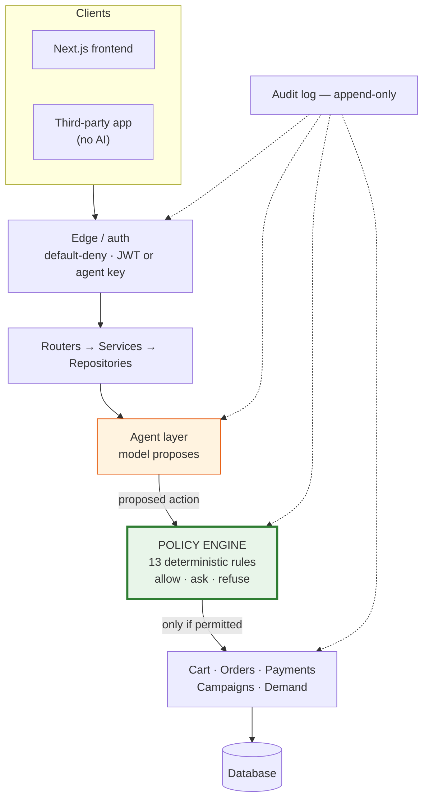

# Razorpay Agentic Commerce

An online grocery store where an **AI shopping agent can spend your money for you** — but only up to
a limit you set, only after a rule engine has approved each step, and with every decision written
down so you can read back exactly why it happened.

The interesting part isn't that an agent can buy things. It's everything built to stop it.

---

## Try it in two minutes

You need **Docker only**. No Python, no Node, no database setup.

```bash
git clone <this repo>
cd razorpay-agent
docker compose up --build
```

Open **http://127.0.0.1:3000** and click **"Continue as Demo Buyer"**.

> **Use `127.0.0.1`, not `localhost`.** A browser treats them as different sites, and sign-in is
> registered against `127.0.0.1`. Using `localhost` looks fine until login fails.

**About that demo login.** The login page offers a pre-seeded buyer and merchant so you can get in
without registering your own Google OAuth client. It exists purely for reviewers. In production the
only way in is Google — those demo accounts are gated on `APP_ENV=development` **in code**, the same
way fault injection is, so the endpoint that issues their tokens simply returns 404 anywhere else.
Not a config flag someone could flip by accident.

First build takes a few minutes. After that it starts in seconds.

| | |
|---|---|
| Storefront and dashboards | http://127.0.0.1:3000 |
| API | http://127.0.0.1:8842 |
| Machine-readable catalog | http://127.0.0.1:8842/.well-known/catalog.json |

The app seeds itself on first run: **51 products across 8 categories**, a demo agent, and some order
history so you don't land on empty screens.

---

## The idea, in one line

> **The AI proposes. A rule engine decides.**

The language model reads what you asked for and *suggests* an action — "add this item", "pay for
this cart". It cannot carry any of them out. Every suggestion goes to a **policy engine**: ordinary
Python, no AI in it, which checks the price, the stock, your budget, and the agent's own spending
limit, then answers **allow**, **ask the human first**, or **refuse** — always with a reason in
plain words.

So if the model is tricked, confused, or swapped for a different one tomorrow, the limits on your
money don't change. They were never written in a prompt the model could be talked out of.

### Four things that are true by construction

Not "by policy" or "by code review" — there is no way to do the opposite, and you can check each in
under a minute.

| Guarantee | Why it holds |
|---|---|
| **The audit log can't be edited or erased** | The code that writes it has *no* update or delete function. There is nothing to call |
| **An agent can never finish a payment on its own** | The payment rule has no code path that returns "allow" — only "ask the human" or "refuse" |
| **Demo logins and fault injection can't exist in production** | Both are gated on the environment *in code*. No env var, header or request can switch them on |
| **Campaign control groups can't be fudged** | The split happens before any offer is evaluated, and is written to the audit log as it happens |

---

## What's real, and what's simulated

Read this before judging the payments. It's the most important section here.

**Razorpay orders in this project are real. Most captured payments are not.**

24 of 25 orders were genuinely created at Razorpay and are verifiable in their dashboard. Only
**one** has a payment Razorpay actually processed — order #1, `pay_TXCrkCuqeuCx7h`, a real card
payment. There is also a real UPI Autopay mandate with ₹5,000 blocked. Every other "captured"
payment id (`pay_auto_*`, `pay_test_*`, `pay_demo*`) was signed locally in test mode and will not
resolve in Razorpay's API.

I found this by checking my own claims against Razorpay's live API instead of trusting my own logs.
The UI now labels each simulated capture in place rather than hiding it. The seeded demo orders you
see on first run are labelled separately again — for those, **neither the payment nor the order ever
reached Razorpay**; they exist so a reviewer has history to look at.

Two other things are simulated, and say so on screen: **campaign redemption and revenue** (a modelled
draw, not measured sales), and **"upsell value accepted"**, which counts offers accepted into a cart
— not payments captured. It used to be labelled "upsell revenue", which claimed more than it
measured.

- **[docs/PAYMENT-REALITY.md](docs/PAYMENT-REALITY.md)** — exactly what is real, with ids
- **[docs/SYSTEM-AUDIT.md](docs/SYSTEM-AUDIT.md)** — a full pre-submission sweep: what was verified
  against the running system, five defects it found and fixed, two claims it found overstated
- **[Failures.md](Failures.md)** — what broke and what I got wrong

Verify any of it yourself against the live API:

```bash
docker compose exec backend python scripts/verify_payments.py
```

---

## Both halves of the track

**Growing the merchant's revenue.** A demand loop that turns real buyer conversations into merchant
action: every shopping chat emits a demand signal, and when enough *distinct* buyers ask for
something that isn't stocked, the merchant gets a notification with aggregate evidence — no raw
queries, no session ids, because buyer identity isn't in that table to begin with. Plus a campaign
orchestrator with segmentation, margin guardrails and control groups, and an upsell agent bounded
per session.

**Making the merchant transactable by an AI buyer.** An agent-readable catalog at
`/.well-known/catalog.json`, credentials a buyer issues and revokes, and conversational checkout.

**`integration-demo/` is the sharpest proof of the second half.** It's a small storefront with **no
model SDK, no AI provider key, and no inference code anywhere in it**. You paste in a credential
issued by this platform, and it shops through our API. Verified end to end: it authenticated as an
agent principal, ran a real agent turn, added two items, generated an upsell, and had **₹211.00 of
its ₹500.00 limit tracked** against the credential — while the same key got `403` from `/api/cart`
and `/api/agents`. None of that depends on our own UI.

---

## Numbers

All real output from this system. Nothing rounded or estimated.

**Safety evaluation** — 28 scenarios covering budget limits, stock, hallucinated SKUs, prompt
injection and edge cases:

| Run | Result | False positives | False negatives |
|---|---|---|---|
| Stub model (deterministic) | **28/28 passed** | 0 | 0 |
| Live model (`nvidia/nemotron-3.5-lightning-30b-a3b`) | **20/25 passed** | **0** | **0** |

The two differ, and the reason matters. The stub run pins the *policy engine* — same input, same
decision, every time. The live run also exercises the model, which is non-deterministic and
sometimes slow enough to time out mid-run (only 25 of the 28 scenarios completed).

**All five live failures were the agent asking a clarifying question where the test expected an
outright refusal.** That's a weaker answer than wanted — but it fails safe. The columns that matter
are the last two: **zero false negatives** (no violation ever got through) and **zero false
positives** (nothing legitimate was wrongly blocked).

**Campaign run** — segments are computed deterministically with no LLM; redemption and revenue are
simulated:

| Segment | Size | Status | Offers sent | Blocked | Net margin impact |
|---|---|---|---|---|---|
| lapsed | 8 | completed | 6 | 0 | ₹125.40 |
| repeat | 10 | completed | 7 | 1 | ₹122.16 |
| high_value | 14 | completed | 2 | 8 | ₹79.50 |
| category_loyal | 7 | completed | 1 | 4 | ₹0.00 |
| one_time | 4 | **blocked at segment** | — | — | — |
| browse_abandonment | 7 | completed | 0 | 5 | ₹0.00 |

The most interesting row is `one_time`: *"only 4 member(s), below the minimum of 5 needed to draw a
reliable conclusion — refusing to run."* The system declined to act on a sample too small to learn
from. The `blocked` column is the margin and discount guardrails refusing individual offers.

**Test suite** — 303 tests, all passing:

```bash
docker compose exec backend python -m pytest -q
```

---

## Architecture at a glance



Green is deterministic. Orange is the only place a model is involved. Nothing green reads model
output as an instruction.

**[docs/ARCHITECTURE.md](docs/ARCHITECTURE.md)** has the full design: layer boundaries, request
lifecycle, data model, state machine, security model, scaling analysis, and the sections on where AI
is deliberately *not* used.

---

## Where AI is used — and where it deliberately isn't

A short version of a longer argument in the architecture doc, because it's the design position I'd
most want read.

**AI is used for three things:** turning your words into a proposed action, pulling structured
demand signals out of free text, and writing campaign copy. All three are open-ended language tasks.

**AI is deliberately not used for:** any money decision, customer segmentation ("3+ orders" is a
definition, not a judgement), discount and margin caps, notification thresholds, product search over
50 items, or order state transitions. Those are definitions, arithmetic and tables — code is faster,
exact, reproducible and testable. One campaign path records this in its own audit trail as
`model_used = "none (deterministic browse-abandonment offer)"`.

---

## Running it properly

Docker is the fastest path. This section is for running it directly.

### Prerequisites

Python 3.13+, Node 22+.

### Backend

```bash
cd backend
python -m venv ../venv
../venv/Scripts/pip install -r requirements.txt   # Windows
# source ../venv/bin/activate && pip install -r requirements.txt   # macOS/Linux

python scripts/seed.py                             # creates tables, loads 51 products
../venv/Scripts/python -m uvicorn app.main:app --reload --port 8842
```

### Frontend

```bash
cd frontend
npm install
npm run dev        # http://127.0.0.1:3000
```

### Environment variables

`cp .env.example .env`. **Everything has a working default — the app runs with no `.env` at all.**
Fill these in only for the features that call outside services:

| Variable | What it's for | Without it |
|---|---|---|
| `NVIDIA_API_KEY` | The model behind the shopping agent | Chat returns an error; everything else works |
| `RAZORPAY_KEY_ID` / `RAZORPAY_KEY_SECRET` | Test-mode payments | Checkout can't create a Razorpay order |
| `GOOGLE_CLIENT_ID` / `GOOGLE_CLIENT_SECRET` | Signing in as *yourself* | Use the demo accounts instead |
| `JWT_SECRET_KEY` | Signs this app's own login tokens | Generate: `python -c "import secrets; print(secrets.token_urlsafe(32))"` |
| `APP_ENV` | `development` enables demo login + fault injection | Anything else disables both, permanently |

For Google sign-in, register **both** of these as authorized redirect URIs on your OAuth client:
`http://127.0.0.1:8842/api/auth/google/callback` and
`http://localhost:8842/api/auth/google/callback`. Pick buyer or merchant at `/onboarding` on first
login.

**Database.** SQLite by default, created automatically — no migration step. Schema changes apply on
startup. Postgres is supported: `docker compose --profile postgres up`.

### Other things you can run

```bash
python demo.py                                        # scripted end-to-end walkthrough
python eval/run.py                                    # the safety evaluation above
python campaigns/run.py                               # the campaign orchestrator
docker compose exec backend python scripts/verify_payments.py   # check payments against Razorpay
```

---

## What broke

Three worth reading. The rest are in **[Failures.md](Failures.md)**.

**1. I verified my own payment claims and found them wrong.** I had been reporting successful
autonomous payments based on my own logs. Checking against Razorpay's live API showed the orders
were real but nearly every capture was locally signed — the money never moved. This produced
`PAYMENT-REALITY.md` and honest labelling throughout the UI, and it's the finding I'd most want a
reviewer to see, because it was self-inflicted and self-caught.

**2. Every server error looked like the backend was down.** A framework detail put the error handler
*outside* the CORS layer, so 500s reached the browser stripped of the headers that let JavaScript
read them. The frontend could only report *"Could not reach the API"* — about a backend that was
running fine and had answered. It sent me hunting for a crash that never happened. Same class of bug
as a logger that swallows stack traces: the diagnosis is destroyed on its way to whoever needs it.

**3. A buyer could never re-order the same basket.** The duplicate-payment guard keyed on cart
contents, reasoning that paying empties the cart so a repeat purchase would look different. It
doesn't — a fresh cart with the same items hashes identically, so the second purchase collided with
the first and was refused *permanently*. For a grocery store, buying the same weekly basket again is
the normal case, not a duplicate. Found by reproducing it, not by reading.

---

## Limitations

Stated plainly rather than discovered.

- **No `payment.captured` webhook.** The system learns about payments from a browser callback. Close
  the tab after paying and Razorpay holds a payment we never hear about. This is the most important
  architectural gap.
- **Four orders (4, 19, 23, 26) are recorded `FAILED` and unreconciled.** The bug that caused it is
  fixed; nothing repairs rows already written. Order #23 in particular shows `FAILED` while Razorpay
  holds a real captured ₹275. Backfilling `PAID` without provider confirmation would mean inventing
  a payment record, which is worse than an honest wrong status.
- **Spend headroom isn't released when you remove an item from the cart.** The reservation is taken
  at add-time and not given back.
- **Per-agent limits don't add up to an account limit.** Three agents at ₹500 each is ₹1,500 of
  exposure that no single rule sees, because every rule evaluates one credential in isolation. The
  supervisor that would close this is designed in the architecture doc and not built.
- **Agent turns take 5–120 seconds**, bounded by the model provider.
- **Single node, SQLite by default.** Fine for a demo; the first thing to replace.
- **A full seller portal was scoped out.** The merchant side is dashboards, catalog controls,
  campaigns and audit — not inventory or fulfilment.

---

## Repository map

```
backend/            FastAPI · policy engine · agent harness · audit
frontend/           Next.js 16 storefront and dashboards
integration-demo/   Third-party storefront with no AI — proof an external agent works
buyer_agent/        Headless script that shops via the API
eval/               Safety evaluation
campaigns/          Campaign orchestrator
docs/               Design record, one document per build layer
```

| Document | What's in it |
|---|---|
| [docs/ARCHITECTURE.md](docs/ARCHITECTURE.md) | Full system design |
| [docs/PAYMENT-REALITY.md](docs/PAYMENT-REALITY.md) | What's real at Razorpay, with ids |
| [docs/SYSTEM-AUDIT.md](docs/SYSTEM-AUDIT.md) | Pre-submission audit and its findings |
| [Failures.md](Failures.md) | Everything that broke |
