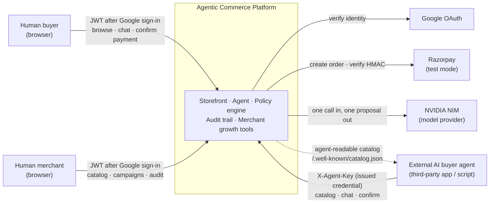
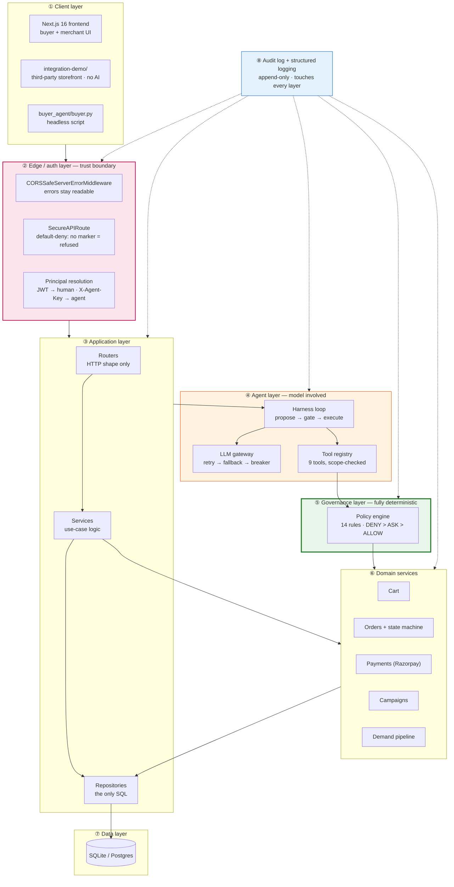
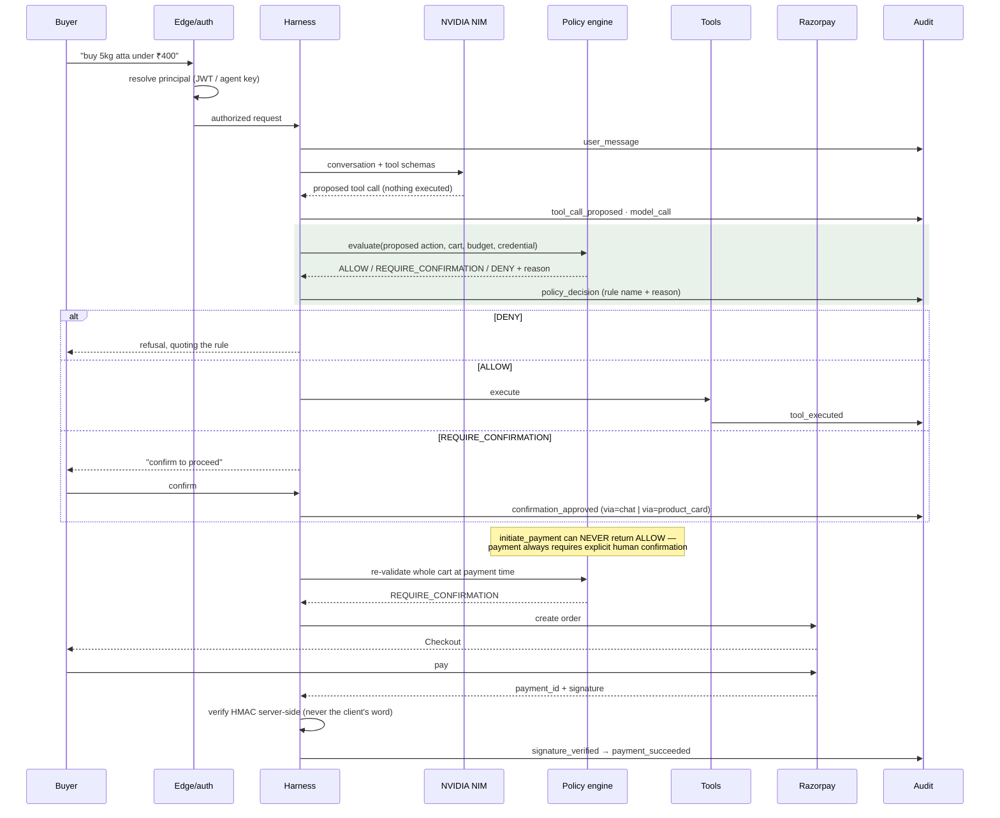
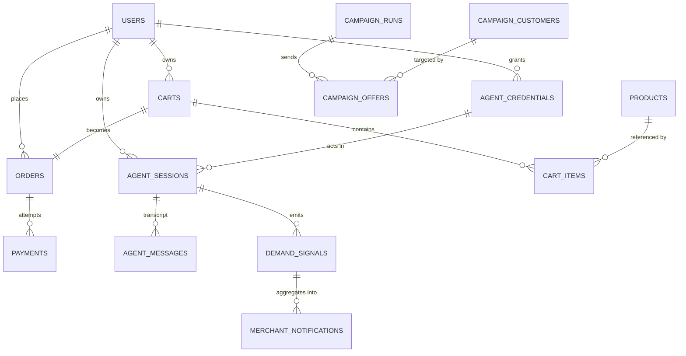
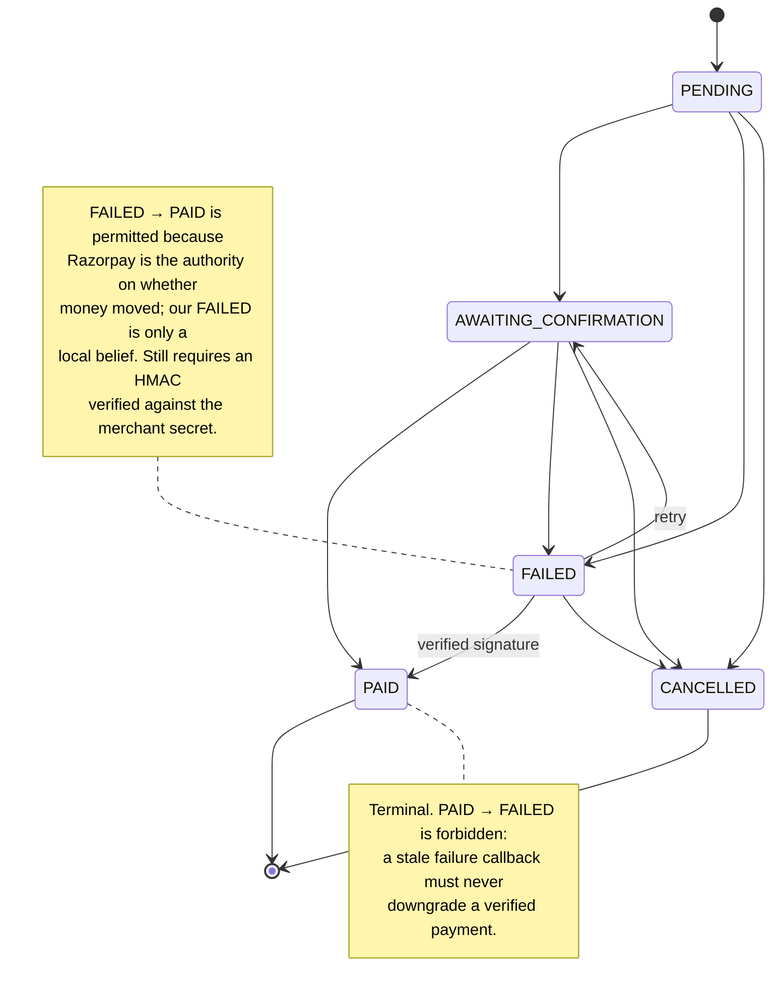
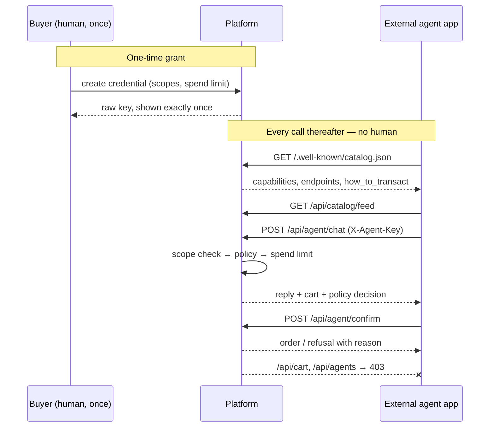
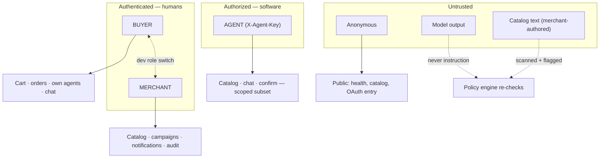
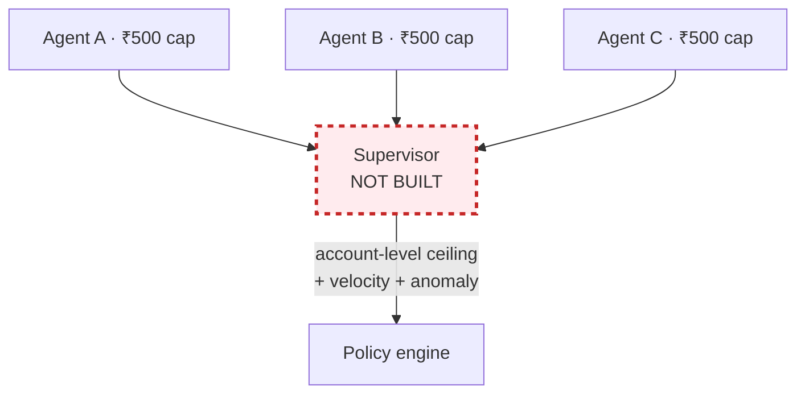

# Architecture

High-level design for an agentic-commerce system in which a software agent can spend a human's
money — bounded by rules the agent cannot reach, and recorded so that every rupee has an
explanation.

Audience: an engineer who wants to understand how this is put together without reading the code.

---

## The thesis

**The policy engine is the product. The agent only proposes.**

A language model decides *what to attempt*; deterministic Python decides *what is permitted*. The
model never executes anything. It emits a proposed tool call, which the policy engine evaluates
against the catalog, the cart, the session budget and the acting credential's own spend limit — and
returns `ALLOW`, `REQUIRE_CONFIRMATION` or `DENY`. Nothing about the model's confidence, phrasing or
reasoning enters that decision. If the model is jailbroken, hallucinating, or replaced tomorrow by a
better one, the bounds on money are unchanged, because they were never expressed to the model in the
first place.

Everything below is in service of that split.

---

## 1. System context



**What crosses each boundary**

| Boundary | Direction | Carries | Trust |
|---|---|---|---|
| Human ↔ platform | in | Google-issued identity, then our own JWT | **Authenticated** |
| Agent → platform | in | `X-Agent-Key`, hashed at rest | **Authorized, never authenticated** |
| Platform → Razorpay | out | order creation, signature verification | External authority on money |
| Platform → NVIDIA | out | conversation + tool schemas | **Untrusted output** |
| Platform → agent | out | catalog, prices, policy decisions with reasons | Public / aggregate only |

The asymmetry in row two is the point. **A human authenticates — they prove who they are. An agent is
authorized — a human grants it a bounded capability.** An agent cannot create another agent, cannot
read its own scopes or spend limit, and cannot reach any buyer-only endpoint.

The NVIDIA row is the other load-bearing one: **model output is data, never instruction.** Tool
results are never spliced into the system prompt, and every proposed action is re-checked by the
policy engine regardless of what the model produced.

---

## 2. Layer view

The main structural diagram. Read top to bottom; each layer may only call the one below it.



**Green is deterministic and load-bearing. Orange is the only layer where a model is involved.**
Nothing in green reads model output as instruction.

### Layer responsibilities

| # | Layer | Responsible for | Must never | At scale |
|---|---|---|---|---|
| ① | Client | Rendering, collecting intent | Hold authority; every check is re-run server-side | CDN; unchanged otherwise |
| ② | Edge/auth | Deciding *who* is calling; failing closed | Let an unmarked route through | Move JWT verify to a gateway; add rate limiting |
| ③ | Application | Use-case orchestration | **Routers never touch the DB** — SQL lives only in repositories | Split read/write paths |
| ④ | Agent | Turning language into *proposals* | Execute anything itself; trust its own output | Queue turns; stream partials |
| ⑤ | Governance | Deciding what is permitted | Consult a model, or be bypassable | Unchanged — this is pure functions |
| ⑥ | Domain | Cart, order, payment, campaign, demand rules | Skip the state machine or write payments directly | Extract payments first |
| ⑦ | Data | Persistence | Hold business logic | Postgres; the code already supports it |
| ⑧ | Audit | Recording every decision with its reason | Offer any update or delete | Async writer; separate store |

The layering rule that does the most work is ③: **routers never touch the database.** A router
parses HTTP and delegates. That is why the policy engine cannot be accidentally bypassed by a new
endpoint — there is no path from HTTP to the database that does not pass through a service.

---

## 3. Request lifecycle — one purchase, end to end



Two things this diagram is drawn to make obvious:

1. **The model's output is a proposal that passes through the green band before anything happens.**
2. **The cart is re-validated at payment time**, not trusted from when items were added — prices,
   stock and limits are all re-checked against the state of the world *now*.

---

## 4. Data model



Grouped by concern:

| Group | Tables | Note |
|---|---|---|
| **Identity** | `users`, `agent_credentials` | An agent is never a `User` row. Only `key_hash` is stored |
| **Commerce** | `products`, `carts`, `cart_items`, `orders`, `payments` | Money is **integer paise**, everywhere |
| **Agent** | `agent_sessions`, `agent_messages` | Full transcript; a session belongs to one credential |
| **Growth** | `demand_signals`, `merchant_notifications`, `product_views`, `campaign_*` | `demand_signals` has **no user_id column at all** |
| **Audit** | `audit_events` | Append-only. 36 event types |

Two deliberate absences. `demand_signals` carries no buyer identity — "distinct buyers" is
approximated by distinct session, so a merchant-facing aggregate *cannot* be de-anonymised, because
the identity is not in the table to select. And `audit_events` has no update or delete path in the
repository at all.

---

## 5. Order state machine



`FAILED → PAID` was added after order #23 was recorded `FAILED` while Razorpay held a real captured
₹275 payment — Checkout reported failure and success out of order within one session. The reverse
remains forbidden.

---

## 6. External AI buyer path

The path that involves no human UI at all.



`/.well-known/catalog.json` is a discovery document: capabilities, endpoint URLs, and a plain-English
`how_to_transact`. It borrows the `/.well-known/` convention from UCP and A2A, and ACP's field names
where they apply — stated precisely in the document itself rather than claiming conformance.

---

## 7. Four guarantees that hold by construction

Not by convention, review, or discipline — by there being no code path to the alternative.

| Guarantee | Mechanism | Where |
|---|---|---|
| **The audit log cannot be rewritten** | The repository exposes `create` plus three reads. There is no update or delete method to call | `app/audit/repository.py` |
| **An agent can never complete a payment alone** | `PaymentAuthorizationRule` has no branch that returns `ALLOW` — only `REQUIRE_CONFIRMATION` or `DENY` | `app/policy/rules.py` |
| **Chaos and demo login cannot exist in production** | Gated on `settings.app_env == "development"` in code. No env var, header or request body can enable them elsewhere | `app/testing/chaos.py`, `app/testing/demo_login.py` |
| **Campaign control groups cannot be gamed** | The control/treatment split happens *before* policy evaluation and is written as a `control_group_split` audit event | `app/campaigns/service.py` |

The first two are the ones worth arguing about, so they are stated as testable properties rather
than intentions: *there is no delete method*, and *there is no ALLOW path*. Both are verifiable by
grep in under a minute.

---

## 8. Policy engine internals

Every rule is a class with one method:

```python
class Rule(ABC):
    def evaluate(self, action: ProposedCartState) -> RuleResult | None: ...
```

`None` means "this rule has no opinion". A `RuleResult` carries a decision, the rule's own name, and
a **human-readable reason built from the actual numbers** — that reason is what reaches the buyer and
the audit trail.

Resolution is simple and total: **`DENY` beats `REQUIRE_CONFIRMATION` beats `ALLOW`**. Within a
decision, registration order breaks ties, so ordering encodes priority — credential checks before
cart arithmetic.

The 14 registered rules:

| Group | Rules |
|---|---|
| Credential | `RevokedCredentialRule`, `AgentScopeRule`, `AgentSpendLimitRule` |
| Content integrity | `InjectionTaintRule` |
| Catalog | `UnknownSkuRule`, `OutOfStockRule`, `StockRule` |
| Limits | `PerItemPriceRule`, `QuantityRule`, `SpendCapRule` |
| Offers | `UpsellPolicyRule` |
| Payment | `ConfirmationThresholdRule`, `DuplicatePaymentRule`, `PaymentAuthorizationRule` |

**Adding a rule** is three steps: implement `evaluate`, register it in `default_policy_engine()` at
the right priority, add a test. No other file changes. Nothing needs to know the rule exists.

**Why deterministic Python and never prompt instructions.** A prompt is a request; a rule is a
constraint. "Never spend more than ₹500" in a system prompt is advice the model may ignore, misread
under adversarial input, or silently drop when the prompt is edited. As Python it is a branch — and
it is re-evaluated at payment time against the cart as it exists then, not as it existed when the
model was persuaded. This also makes the bound *auditable*: a reviewer can read fourteen small
classes and know the complete set of things that can stop a purchase.

`PaymentAuthorizationRule` is worth reading closely: rather than duplicating thresholds, it replays
every cart line through the item-level rules as if being freshly added, and surfaces the underlying
rule's name on failure — so the audit line says `SpendCapRule`, not a useless wrapper name.

---

## 9. Where AI is used, and where it deliberately isn't

This is a design position, not an omission.

### AI is used for exactly three things

| Use | Why a model earns its place |
|---|---|
| **Intent → tool calls** | Mapping "5kg atta under ₹400" onto a tool call with arguments is genuinely open-ended language understanding |
| **Demand-signal extraction** | Pulling a category and constraints out of free text, where the phrasing space is unbounded |
| **Campaign copy + rationale** | Writing an offer message is a language task with no correct answer |

### AI is deliberately *not* used for

| Task | What is used instead | Why |
|---|---|---|
| **Every money decision** | The policy engine | A bound that a model can be talked out of is not a bound |
| **Customer segmentation** | Deterministic SQL + Python | "3+ orders" is a definition, not a judgement. An LLM would add cost, latency and non-reproducibility for nothing |
| **Offer sizing / discount caps** | `DiscountCapRule`, `MarginFloorRule` | Margin protection must be exact and provable |
| **Demand thresholds** | `max(5, active_buyers × 0.20)` | A threshold is arithmetic |
| **Notification aggregation** | Grouped counts | Deterministic and idempotent — safe to recompute on every read |
| **Product search over 50 SKUs** | SQL `LIKE` + tags | A vector DB for 50 products is infrastructure cost with no accuracy gain |
| **Order state transitions** | A pure state machine | Correctness here is a table, not an inference |

One campaign path records this explicitly in its own audit trail:
`model_used = "none (deterministic browse-abandonment offer)"`.

**The rule of thumb applied throughout:** if the answer is a definition, arithmetic, or a table, it
is code. If the answer is open-ended language, it is a model — and its output is then treated as an
untrusted proposal.

---

## 10. Key design decisions

| Decision | Alternative rejected | Reason |
|---|---|---|
| Policy engine as code | Rules in the system prompt | A prompt is advice; a branch is a constraint. Also auditable and testable |
| `Model.invoke()` | Agno's `Agent.run()` | `Agent.run()` **auto-executes tool calls**, which would bypass the policy gate entirely. `invoke()` returns one proposal and executes nothing — the harness stays in control |
| Integer paise | Float rupees | Float money accumulates rounding error. Every amount in the system is an integer |
| No vector DB | pgvector / Chroma | 50 products. `LIKE` + tags is faster, exact, and has no index to drift |
| Agents authorized, not authenticated | Give agents user accounts | An agent is a *capability a human grants*, revocable independently, with its own scopes and cap. A user account would make it a peer of its owner |
| Append-only audit by construction | Soft-delete flag | A flag is a convention someone can bypass. No delete method is a property |
| SQLite by default | Postgres required | One command from clone to running. The code is engine-agnostic; Postgres is a compose profile |
| Idempotency includes `cart_id` | Content hash only | Without it, re-ordering an identical basket collided with the previous purchase and was refused forever |

---

## 11. Non-functional requirements

| Requirement | How it is met | Honest status |
|---|---|---|
| **Idempotency** | Content + cart hash with a DB `UNIQUE` constraint; insert-then-catch, never check-then-insert | Met |
| **Observability** | 36 audit event types; structured JSON logs with `request_id` threaded through; session replay | Met |
| **Reliability** | Retry → fallback model → circuit breaker; 7 injectable faults | Met |
| **Security** | Default-deny routing; HMAC verified server-side; keys hashed at rest; scoped credentials | Met for the modelled threats |
| **Data integrity** | Pure state machine; integer money; append-only audit | Met |
| **Latency** | Catalog reads are ms. **Agent turns are 5–120s**, bounded by the model provider | **Not met, and not solvable here** — it is provider latency, visible in the UI as a pending state |
| **Availability** | Single node, single process | Not a goal for this build |

---

## 12. Failure modes

| Failure | Response | Recorded as |
|---|---|---|
| Model unavailable | Retry → fallback model → circuit breaker fails fast for a cooldown | `model_call_failed` |
| Model emits malformed tool call | Rejected before execution | `malformed_tool_call` |
| Model invents a SKU | `UnknownSkuRule` denies | `policy_decision` |
| Model loops | Hard cap at 8 iterations | `iteration_limit_hit` |
| Injection text in catalog data | Flagged; policy re-checks the action regardless | `injection_detected` |
| Razorpay unreachable | Order marked `FAILED`, retryable | `razorpay_order_failed` |
| Tampered payment signature | Refused; order not marked paid | `signature_rejected` |
| Duplicate payment attempt | Existing order returned, no second charge | `duplicate_payment_prevented` |
| Repeat failure callback | Idempotent; no 500 | `payment_failed` |
| Late verified success after failure | Recovered to `PAID` with an explicit event | `payment_recovered_after_failure` |
| Unhandled server error | 500 **with CORS headers**, so the browser can read it | `unhandled exception` + traceback |

---

## 13. Scaling analysis — what breaks first

In order:

1. **SQLite, under concurrent writes.** Single writer. First thing to hit. Mitigation exists today:
   `DATABASE_URL` already accepts Postgres and a compose profile ships it.
2. **Synchronous audit writes.** Every decision writes a row in the request path. At volume this
   becomes the dominant cost of a turn. Fix: async writer or an append-only log store — the
   repository interface is narrow enough that this is a contained change.
3. **No `payment.captured` webhook.** The system learns about payments from a browser callback. If
   the buyer closes the tab after paying, Razorpay holds a captured payment the system never hears
   about. **This is the most important architectural gap**, and it is why four orders remain
   unreconciled. A webhook is the correct answer and is not built.
4. **Single node, in-process background work.** Title generation runs on a thread. Anything more
   needs a real queue.
5. **Per-request model latency.** 5–120s per agent turn. Unfixable in-process; needs streaming or a
   job model.

---

## 14. Security model



Principal types and their reach:

- **BUYER** — own cart, own orders, own agents, chat.
- **MERCHANT** — catalog, campaigns, notifications, audit. No access to any buyer's cart.
- **AGENT** — a scoped subset, bounded by `spend_limit_paise`. Cannot mint credentials, cannot read
  its own configuration, cannot reach buyer-only endpoints.

Model output and merchant-authored catalog text are both treated as untrusted input. Catalog text
that contains instruction-like content is flagged at snapshot time and refused by
`InjectionTaintRule` before any money rule is consulted — the scanner's finding is an input to a
rule, not only an audit event.

### The provenance gap

`InjectionTaintRule` defeats injection arriving through **tainted product text**, which is the
vector this system exposes. It is not a general defence against prompt injection, and the reason is
worth stating precisely rather than leaving for someone to discover.

**Nothing in this system verifies that a proposed action traces back to something the user asked
for.** `ProposedCartState` — the only object the rules see — carries the session, the user, the
tool, the budget, the cart, a catalog-resolved product, and the acting credential's limits. It
carries no user intent, no link to the originating message, no provenance. A rule *structurally*
cannot ask "did the human request this?", because the information is not in the object.

So the bounds are on **quantity, price, stock, scope, budget, credential limits and duplicates** —
never on origin. Injection arriving by some route other than product text (a compromised tool
response, a poisoned conversation history, a future integration returning attacker-controlled
content) would meet exactly the same rules, and they would evaluate it on its numbers alone.

What holds regardless is the payment boundary: `PaymentAuthorizationRule` has no `ALLOW` path, so no
injected action can move money by itself. The worst available outcome is an item placed in a cart,
waiting for a human to confirm a payment they already intended — a confused-deputy attack whose last
line of defence is the buyer noticing an unfamiliar line item. That is human attention, not a rule.

This is the same shape as the supervisor's aggregate-limit gap below: **a bound that is real, but
does not compose into the guarantee someone might reasonably assume from it.** Closing it needs
intent to be a first-class input to the policy engine — the proposed action carrying a reference to
the user turn that motivated it, and a rule that refuses actions which cannot be traced to one.

---

## 15. The supervisor — designed, not built

The natural next layer, described here because its absence is a real limitation rather than an
oversight.



**The gap it would close: per-credential limits do not compose.** Each agent is correctly bounded at
₹500. Three agents are three separate ₹500 bounds — **₹1,500 of account exposure that no single rule
sees**, because every rule evaluates one credential's action in isolation. Nothing in the system
today enforces a ceiling across an owner's agents.

A supervisor would add an account-level aggregate cap, velocity limits across credentials, and
anomaly detection on spending patterns. It is deliberately named rather than quietly omitted: an
agentic-commerce system that claims bounded spend should be explicit about the boundary its bounds
do not cross.

---

## Reading order for the code

| To understand | Read |
|---|---|
| The thesis in one file | `app/policy/rules.py` |
| How an agent is stopped | `app/policy/engine.py` |
| Why a model can't execute anything | `app/agent/harness.py` |
| Default-deny | `app/auth/routing.py` |
| What is real at Razorpay | `app/payments/gateway.py`, then [PAYMENT-REALITY.md](PAYMENT-REALITY.md) |
| What broke | [../Failures.md](../Failures.md) |
| What was verified | [SYSTEM-AUDIT.md](SYSTEM-AUDIT.md) |
